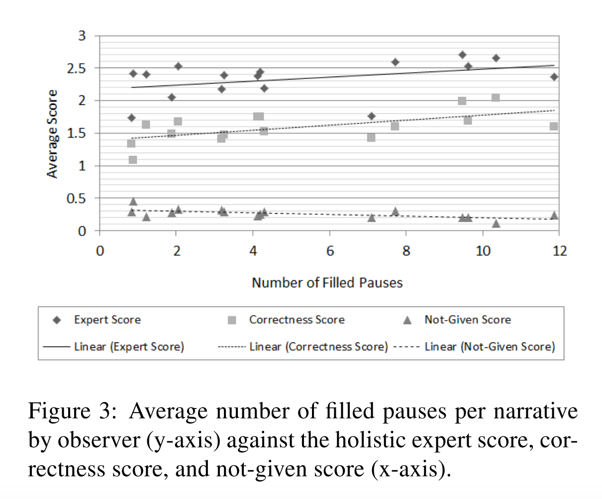

# Critical plot analysis task

## Plot Source

> *Kathryn Womack, Wilson McCoy, Cecilia Ovesdotter Alm, Cara Calvelli, Jeff B. Pelz, Pengcheng Shi, and Anne Haake. 2012*. **Disfluencies as extra-propositional indicators of cognitive processing**. In Proceedings of the Workshop on Extra-Propositional Aspects of Meaning in Computational Linguistics (ExProM '12). Association for Computational Linguistics, Stroudsburg, PA, USA, 1-9. [Available online](http://www.aclweb.org/anthology/W12-3801).

## Plot Context

The paper is intended to confirm the hypothesis *that a higher quantity of filled pauses indicates increased cognitive load*. The authors selected a group of dermatologists at a hospital and asked them to diagnose a skin lesion image thinking out loud, as explaining to a student, while being recorded. Three expert dermatologists evaluated the diagnosis of the group of doctors according to the following criteria:

* **holistic expert score**: based on “relevancy, thoroughness, and accuracy” of each narrative from 1 to 3 with 3 being the best.
* **correctness score**: spans from 0 to 3, with one-third of a point given per independent annotator for each step (i.e. medical lesion morphology, differential diagnosis, and final diagnosis) if correct and $\frac{1}{3} \cdot 0.5$ points given for correct but incomplete
* **not-given score**: similar to the correctness score, spanned from 0 to 3 with one-third of a point given per annotator for each step if the original observer did not provide that information.

## Provided Description

> The graph of filled pauses in Figure 3 indicates that the increase in the number of filled and silent pauses in- volve more cognitive processing. That the not-given score tends to inversely decrease could indicate very little cognitive processing (e.g., if an observer was so unsure that they did not even hazard a guess).

## Critical Analysis 

* **PROs**
    + The plot allows the comparison of different score types across the number of pauses.
    + This configuration allows us to see linear relations in the data. 
* **CONs**
    + Jitter was added to the plot, so can it be confusing to interpret two near points.
    + The scores span different value ranges.
    + "Expert score"" and "Correctness Score"" seem redundant. 

